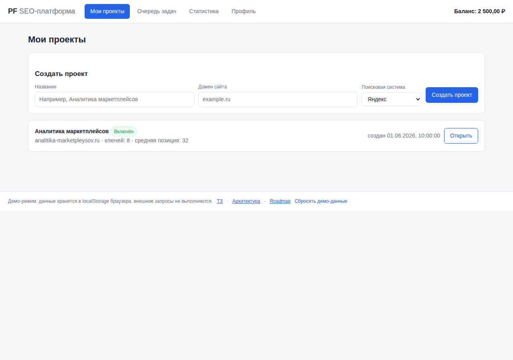
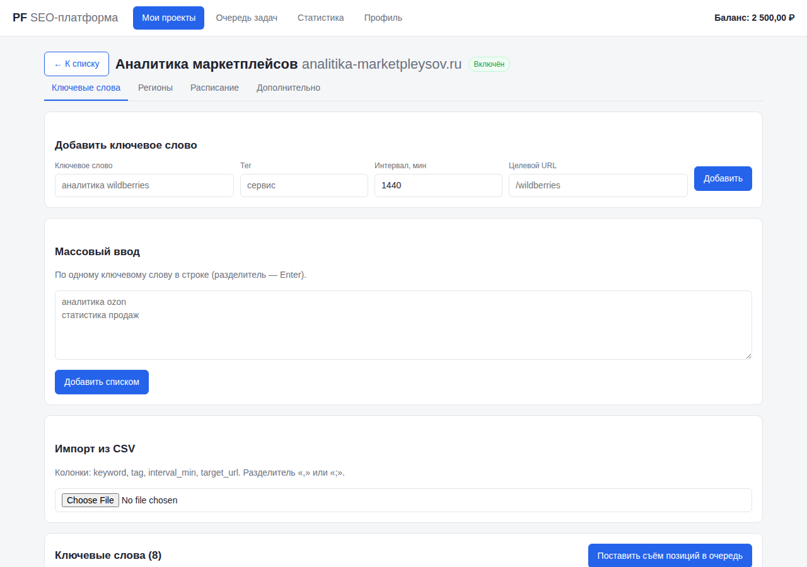
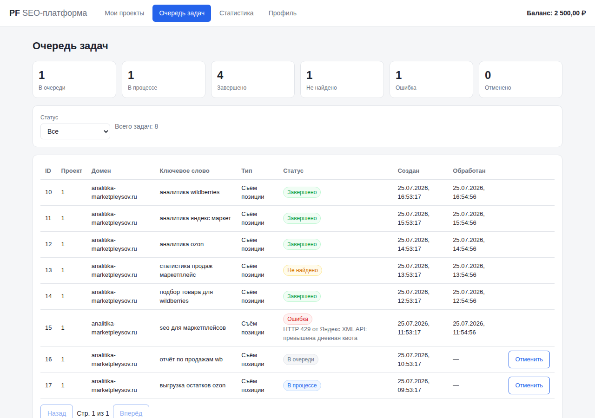
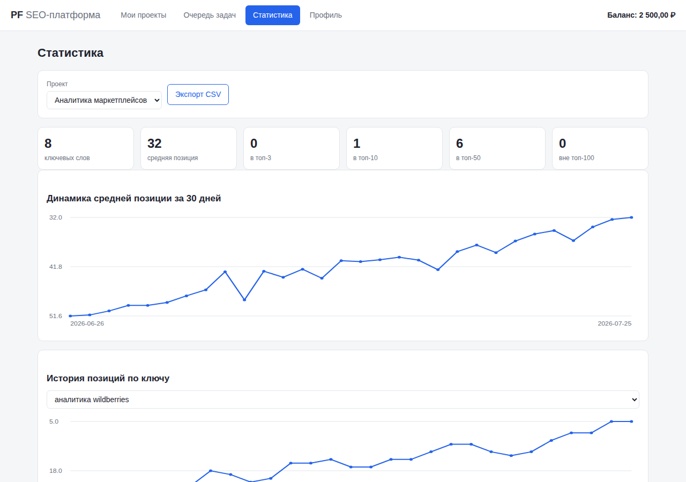

# PF — SEO- и аналитическая платформа

Внутренний инструмент для SEO-команды: отслеживание позиций сайтов в Яндексе и Google
через **официальные API**, частотность запросов из Яндекс.Wordstat, технический аудит
собственных сайтов, аналитика конверсий и отчётность. Версия `0.0.1`.

**Демо личного кабинета:** https://glsfull.github.io/pf/ (публикуется автоматически, см.
[инструкцию](docs/DEPLOY-GITHUB-PAGES.md)).

## Документация

| Документ | Содержание |
| --- | --- |
| [docs/TZ.md](docs/TZ.md) | Переработанное техническое задание |
| [docs/ARCHITECTURE.md](docs/ARCHITECTURE.md) | Диаграмма компонентов, схема БД, описание REST API, ключевые фрагменты кода |
| [docs/ROADMAP.md](docs/ROADMAP.md) | Этапы с задачами, DoD и блоком «Что делать дальше» |
| [docs/DEPLOY-GITHUB-PAGES.md](docs/DEPLOY-GITHUB-PAGES.md) | Пошаговая публикация демо на GitHub Pages |

## Об изменении предметной области

Исходное ТЗ описывало сервис накрутки поведенческих факторов в Яндексе: эмуляция кликов
живых пользователей, пул чужих аккаунтов, антидетект-фингерпринты, обход капчи. Это
нарушает пользовательское соглашение Яндекса, поэтому такой сервис не реализуется.

Вместо этого построена легитимная платформа, которая переиспользует бо́льшую часть
описанного интерфейса и модели данных: проекты, ключевые слова, регионы, расписание,
очередь задач, статистика, биллинг через ЮKassa. Сопоставление «было → стало» — в
[TZ.md, §0](docs/TZ.md).

## Возможности демо-кабинета

- **Мои проекты** — создание проекта (название + домен с нормализацией), включение/выключение,
  подтверждение владения доменом, удаление.
- **Ключевые слова** — ручное добавление, массовый ввод (Enter как разделитель), импорт CSV
  (`keyword, tag, interval_min, target_url`), редактирование интервала/тега/целевого URL, удаление.
- **Регионы** — Москва, Санкт-Петербург, Самара (параметр `lr` официального API).
- **Расписание** — дни недели, часовое окно, глобальный рубильник проекта.
- **Очередь задач** — статусы `queued/running/done/not_found/error/cancelled`, счётчики,
  фильтр, пагинация, отмена задач.
- **Статистика** — KPI (средняя позиция, топ-3/10/50), графики динамики, история позиций
  по ключу, частотность Wordstat, экспорт CSV.
- **Профиль** — баланс, пополнение (демо-ЮKassa), история платежей, настройки.

Демо хранит данные в `localStorage` и не выполняет внешних запросов.

## Скриншоты

| Проекты | Ключевые слова |
| --- | --- |
|  |  |

| Очередь задач | Статистика |
| --- | --- |
|  |  |

## Разработка

```bash
npm install
npm start                                  # http://127.0.0.1:4173/app/
npx playwright install --with-deps chromium
npm test                                   # 10 e2e-тестов демо-кабинета
```

CI: [`tests.yml`](.github/workflows/tests.yml) — e2e на каждый push и PR;
[`pages.yml`](.github/workflows/pages.yml) — деплой демо на GitHub Pages из `main`.

## Структура репозитория

```
app/                  демо личного кабинета (статика для GitHub Pages)
  index.html
  css/app.css
  js/api.js           слой данных: контракт будущего REST API поверх localStorage
  js/ui.js            помощники отрисовки, SVG-график
  js/main.js          экраны и роутинг
docs/                 ТЗ, архитектура, roadmap, инструкция по деплою
tests/app.spec.js     e2e-тесты Playwright
```

## Границы, зафиксированные навсегда

1. Платформа не эмулирует поведение пользователей в поисковых системах и не накручивает
   поведенческие факторы; позиции снимаются только через официальные API.
2. Краулинг и e2e-сценарии выполняются только по доменам с подтверждённым владением.
3. Соблюдаются `robots.txt`, лимиты запросов и условия использования внешних API.
